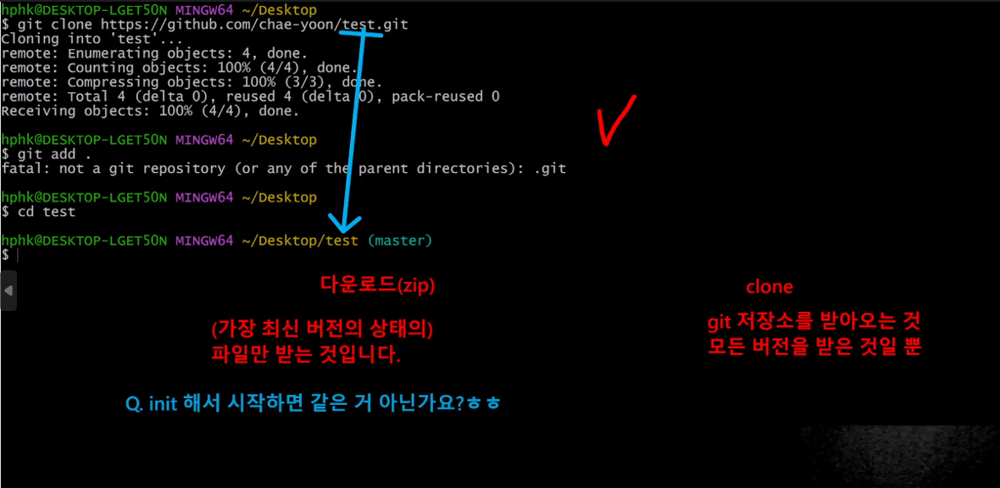
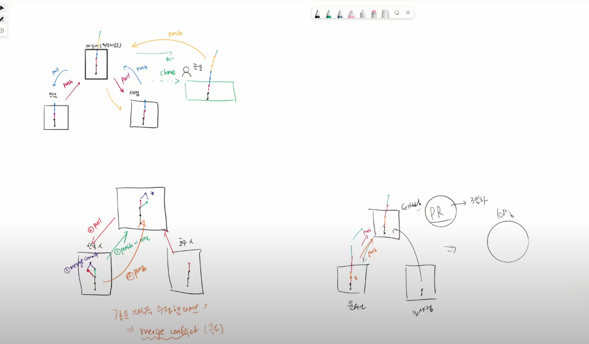
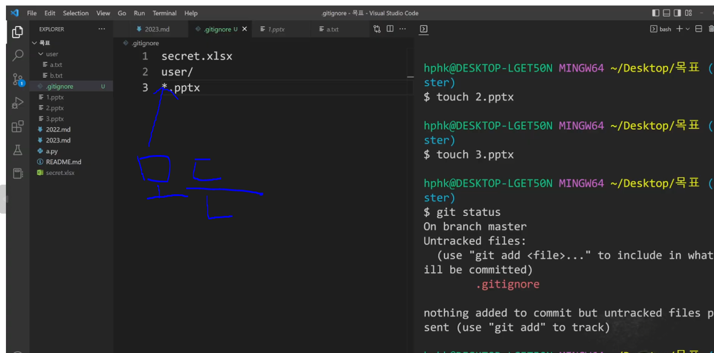

# git: 분산버전 관리시스템

```
C : create
R : read
U : update
D : delete
```

# 다운로드 VS CLONE

```
다운로드(zip) : 가장 최신 버전 상태의 파일만
CLONE : 모든 버전
```



# 명령어

```
-get clone url                : 원격 저장소 복제
-git add .                    : 전부 추가
-git remote -v                : 원격저장소 정보 확인
-git remote add 원격저장소 url : 원격저장소 추가(일반적으로 origin)
-git remote rm 원격저장소      : 원격저장소 삭제
-git push 원격저장소 브랜치     : 원격저장소에 push
-git pull 원격저장소 브랜치     : 원격저장소로부터 pull

```

# PUSH PULL



# .gitignore

```
git에 포함시키고 싶지 않은 내용
```



# 추가정보

```
git pull origin master --allow-unrelated-histories
error: remote origin already exists  --> git remote rm origin (기존 것 삭제)
```
